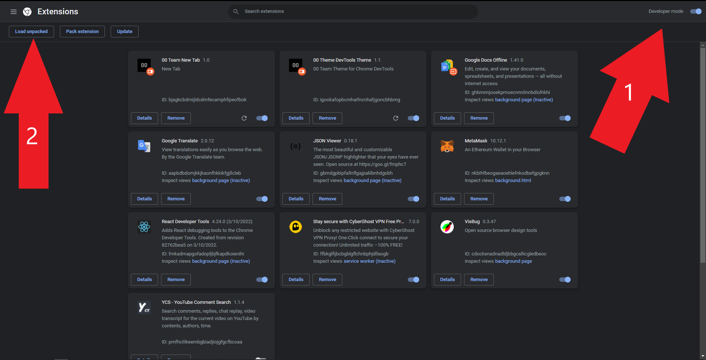

# 00 Team Chrome Extensions

00 Team Custom Chrome Extensions

## Basic Usage

Since these packages are unpacked and not published into the google chrome web store for using them, you need to: first, open the chrome extensions page `chrome://extensions/`

Then make sure the Developer mode toggle checkbox at the top right of the page is ON

After that, you can click on the Load unpacked button and load your extensio
