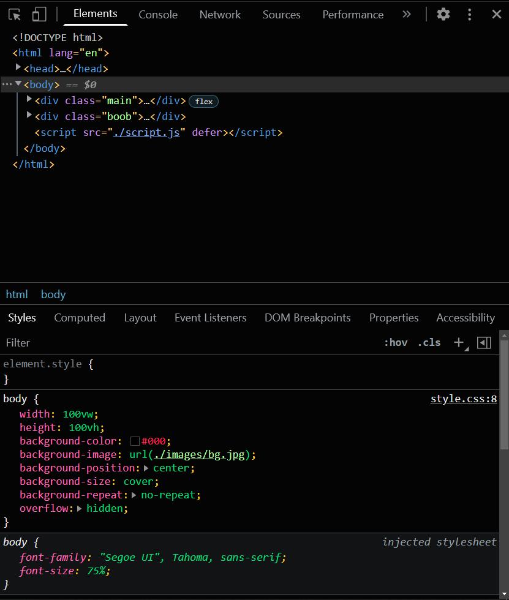
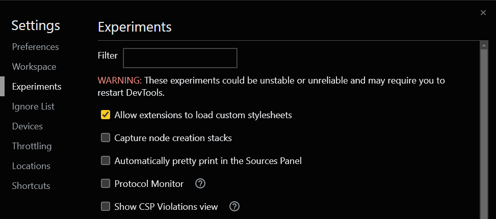

# 00 Team Devtools Theme

a custom black theme for chrome devtools

after loading this extension on your chrome, you need to enable
`allow extensions to load custom stylesheets` in your devtools **Settings** > **Experiments** and also you need to use devtools dark mode!

